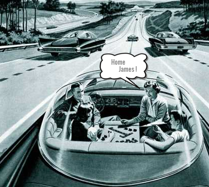
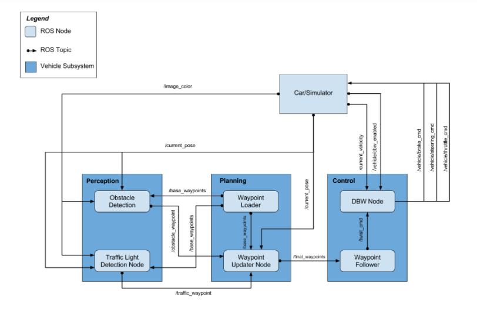
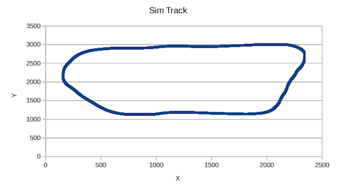
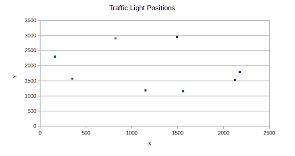
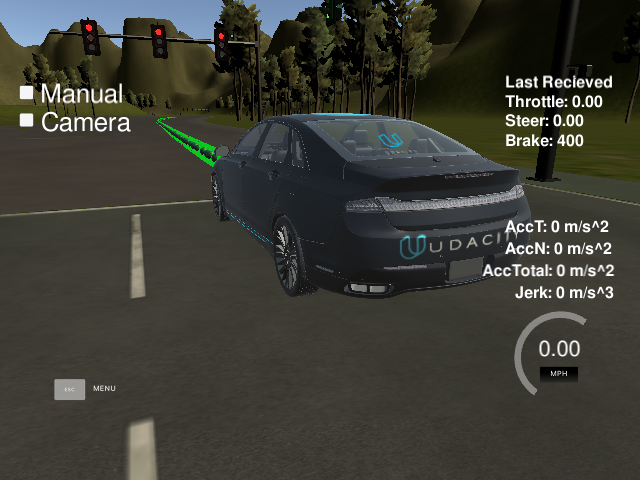

#Udacity 
#Self Driving Car Nanodegree

##Term 3 Capstone Project
###System Integration: Programming a real self driving car 




###Team "Home James!"

* Kevin Randall	 - 784spruce@gmail.com (Team Lead)

* Driss Squalli - drisspa@gmail.com

* Grigory Kostromin - grigory.kostromin@gmail.com

* Sharon Liu - sliu810@gmail.com

* Harish Vadlamani - harish3110@gmail.com


This is the final project of Udacity's Self Driving Car (SDC) Nanodegree program. In this project we use the open source Robotic Operating System (ROS) together with dataspeed Drive By Wire (DBW) to control a vehicle's steering, brake and accelerator. Code is tested on Udacity's simulator and (having passed review) is loaded on to Carla - Udacity's Lincoln MKZ SDC, to navigate a test lot. This project leverages skills and techniques acquired from earlier projects in the program.

ROS uses the concept of nodes as discrete processing units that "publish" (send) "topics" (data) that are received by "subscribers". The architecture for this project is illustreted in block diagram below. 



This project essentially uses the same track as Path Planning (term 3, project 1) except here the waypoints are closely spaced (about 0.5 meters apart), so waypoint interpolation is not necessary for this project.


In addition the capstone project sim track features 8 Traffic lights, locations around the track are shown below:



In the figure below, the Udacity Sim vehicle is being held (brake = 400, throttle = 0) behind the stop line for a red light using code in this repo.



###Code

The three main components that we completed for this project are briefly described below.

#####Waypoint updater

Track waypoints are loaded at initialization. Based on the current pose of the vehicle the waypoint updater assigns target linear and angular velocities, depending on traffic lights and obstacles, for 200 waypoints ahead of the vehicle. 

#####Traffic Light Detector

Traffic light stop line positions are read in at initialization from the configuration file - src/tl_detector/sim_traffic_light_config.yaml.

Camera images (from the /image_color topic) are classified as containing a red light, or not. The index of an upcoming red light is passed to the waypoint updater decreasing upcoming target velocities, so that the vehicle stops short of a red light. For a green light the waypoint updater will increase target velocities to a preset maximum velocity (or maintain maximum velocity).

#####Drive by wire

The DBW node utilizes PID and lowpass filter control to smoothly adjust throttle, brake and steering according to the waypoint target velocities.

####Implementation
In this version we have used an existing CNN image classification model (from Team America) to detect upcoming red lights. We are currently working on a version using our own classifier.

Testing included verifying that the vehicle maximum speed was limited according to the configuration file and that toggling between auto and manual conrol did not introduce instabilty from accumulated integral errors in the PID controller for example.


#####Docker Image for Tensorflow with GPU acceleration

Ubuntu is necessary for this project. Slack and forum discussions indicate that the vehicle becomes uncontrolllable if trying to run project code in a Virtual Machine (VM) - for example running a Ubuntu VM on a windows machine. 

Initial testing showed slight performance issues even with a native Ubuntu 16.04 desktop (Intel i5-4430 with 16GB RAM), when using the image classifier. Utilizing an Nvidia Titan X Pascal GPU (12GB) on this system solved performance issues. Using Tensorflow GPU acceleration requires a modified Docker image. Files to create the image are included in the Docker-gpu directory, and are based on Attila Babo (https://gist.github.com/babo/94309eac327209ca68867fb579bb12be) 


Build the docker image with gpu support:

bash docker build . -t capstone_gpu

Run the docker file:

sudo nvidia-docker run -e DISPLAY=$DISPLAY -p 4567:4567 -v $PWD:/capstone -v
/tmp/log:/root/.ros/ -v /tmp/.X11-unix:/tmp/.X11-unix:rw --rm -it capstone_gpu


____
Udacity SDC readme continues below
____


This is the project repo for the final project of the Udacity Self-Driving Car Nanodegree: Programming a Real Self-Driving Car. For more information about the project, see the project introduction [here](https://classroom.udacity.com/nanodegrees/nd013/parts/6047fe34-d93c-4f50-8336-b70ef10cb4b2/modules/e1a23b06-329a-4684-a717-ad476f0d8dff/lessons/462c933d-9f24-42d3-8bdc-a08a5fc866e4/concepts/5ab4b122-83e6-436d-850f-9f4d26627fd9).


Please use **one** of the two installation options, either native **or** docker installation.

### Native Installation

* Be sure that your workstation is running Ubuntu 16.04 Xenial Xerus or Ubuntu 14.04 Trusty Tahir. [Ubuntu downloads can be found here](https://www.ubuntu.com/download/desktop).
* If using a Virtual Machine to install Ubuntu, use the following configuration as minimum:
  * 2 CPU
  * 2 GB system memory
  * 25 GB of free hard drive space

  The Udacity provided virtual machine has ROS and Dataspeed DBW already installed, so you can skip the next two steps if you are using this.

* Follow these instructions to install ROS
  * [ROS Kinetic](http://wiki.ros.org/kinetic/Installation/Ubuntu) if you have Ubuntu 16.04.
  * [ROS Indigo](http://wiki.ros.org/indigo/Installation/Ubuntu) if you have Ubuntu 14.04.
* [Dataspeed DBW](https://bitbucket.org/DataspeedInc/dbw_mkz_ros)
  * Use this option to install the SDK on a workstation that already has ROS installed: [One Line SDK Install (binary)](https://bitbucket.org/DataspeedInc/dbw_mkz_ros/src/81e63fcc335d7b64139d7482017d6a97b405e250/ROS_SETUP.md?fileviewer=file-view-default)
* Download the [Udacity Simulator](https://github.com/udacity/CarND-Capstone/releases).

### Docker Installation
[Install Docker](https://docs.docker.com/engine/installation/)

Build the docker container
```bash
docker build . -t capstone
```

Run the docker file
```bash
docker run -p 4567:4567 -v $PWD:/capstone -v /tmp/log:/root/.ros/ --rm -it capstone
```

### Port Forwarding
To set up port forwarding, please refer to the [instructions from term 2](https://classroom.udacity.com/nanodegrees/nd013/parts/40f38239-66b6-46ec-ae68-03afd8a601c8/modules/0949fca6-b379-42af-a919-ee50aa304e6a/lessons/f758c44c-5e40-4e01-93b5-1a82aa4e044f/concepts/16cf4a78-4fc7-49e1-8621-3450ca938b77)

### Usage

1. Clone the project repository
```bash
git clone https://github.com/udacity/CarND-Capstone.git
```

2. Install python dependencies
```bash
cd CarND-Capstone
pip install -r requirements.txt
```
3. Make and run styx
```bash
cd ros
catkin_make
source devel/setup.sh
roslaunch launch/styx.launch
```
4. Run the simulator

### Real world testing
1. Download [training bag](https://s3-us-west-1.amazonaws.com/udacity-selfdrivingcar/traffic_light_bag_file.zip) that was recorded on the Udacity self-driving car.
2. Unzip the file
```bash
unzip traffic_light_bag_file.zip
```
3. Play the bag file
```bash
rosbag play -l traffic_light_bag_file/traffic_light_training.bag
```
4. Launch your project in site mode
```bash
cd CarND-Capstone/ros
roslaunch launch/site.launch
```
5. Confirm that traffic light detection works on real life images
